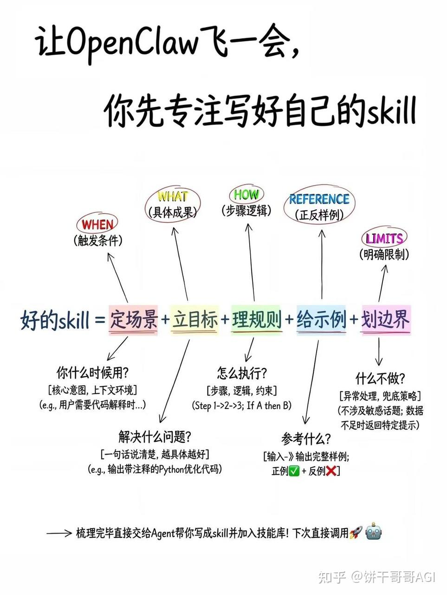
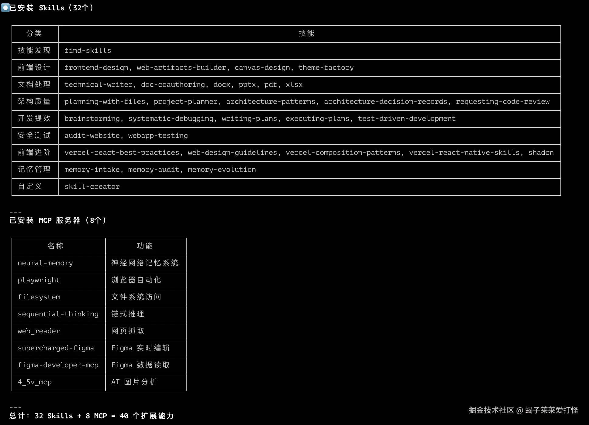

# 知识搜索汇总
    今日新闻简报
    AI/科技资讯速递
    Telegram / 社群日报
    运营晨报
    国际热点汇总

# Skills 收集
   1. news-summary：ClawHub 地址：https://clawhub.ai/joargp/news-summary
        这个 skill 的作用很直接：
        抓取 BBC、Reuters、NPR、Al Jazeera 等 RSS 新闻源自动整理为世界、商业、科技等板块输出简洁摘要还支持进一步做语音摘要
        news-summary 的优势是：
        信息源相对稳定结果结构化适合继续二次加工很适合当其他技能的前置输入也就是说
        它本质上不是“看新闻的 UI”，而是一个新闻摘要生成器。

    2. newspaper-brief：ClawHub 地址：https://github.com/EisonMe/newspaper-brief
        这个 skill 是我觉得最有“展示感”的部分。它做的事不是单纯输出文字，而是：接收原始内容或摘要转成结构化 JSON渲染成 HTML再导出成报纸风手机长图它支持这样的输入：原始文章聊天记录会议纪要已经整理好的 bullets / summary输出效果很适合：手机查看社群转发Telegram 发图做“日报 / 简报图”把本来很像聊天记录的内容，变成更像“成品”的信息卡片它的核心价值我认为是： 把“聊天流信息”切成“版面流信息”。很多 AI 输出其实内容没问题，问题是看起来不像成品。newspaper-brief 刚好补上了这一步。

# openclaw 重点思考问题
1. OpenClaw AGENTS.md 怎么写？有没有现成模板？
2. OpenClaw 聊着聊着 AI 就"失忆"了，memoryFlush 怎么配置？
3. OpenClaw 怎么让 AI 自己维护记忆、防止记忆腐烂？
4. OpenClaw 子 Agent 怎么用？怎么让 AI 并行处理任务？
5. OpenClaw 怎么设置每天自动发新闻摘要、定时周报？
6. OpenClaw Discord 接入手把手教程，MESSAGE CONTENT INTENT 应该怎么开？
7. OpenClaw Telegram Bot 怎么配置？
8. OpenClaw 怎么开发自定义 Skill？
9. OpenClaw 想要真正跑起来，需要顶级LLM做大脑，自动化RPA做手脚，高质量Skills做说明书，而落地最重要的一点——你的业务得先SOP化。
10. OpenClaw 3.22 深度解读：108 次提交、9 项破坏性变更，这只龙虾要「脱壳重生」了  https://zhuanlan.zhihu.com/p/2019670116128792830
11. RPA 自动化流程：把RPA、Coze、n8n这些和OpenClaw整合在一起——n8n、Coze和RPA作为Skill，给OpenClaw去调度。
12. 这个开源项目爆火了：180名AI员工 ，分布于 17 个部门  https://zhuanlan.zhihu.com/p/2018323825935262516
13. 驯龙高手系列2：OpenClaw 关键 MD 文档详解  https://zhuanlan.zhihu.com/p/2015303685710833101
14. openclaw有哪些好用的skill？ https://www.zhihu.com/question/2006661884057769505/answer/2015417134826681534
15. openclaw 飞书多agent协作怎么玩？ https://www.zhihu.com/question/2013687077116606352/answer/2019473288544395991
16. OpenClaw下载量 Top 20 的神仙级技能包分享 https://zhuanlan.zhihu.com/p/2019428885486388929

# 图解
  
  

