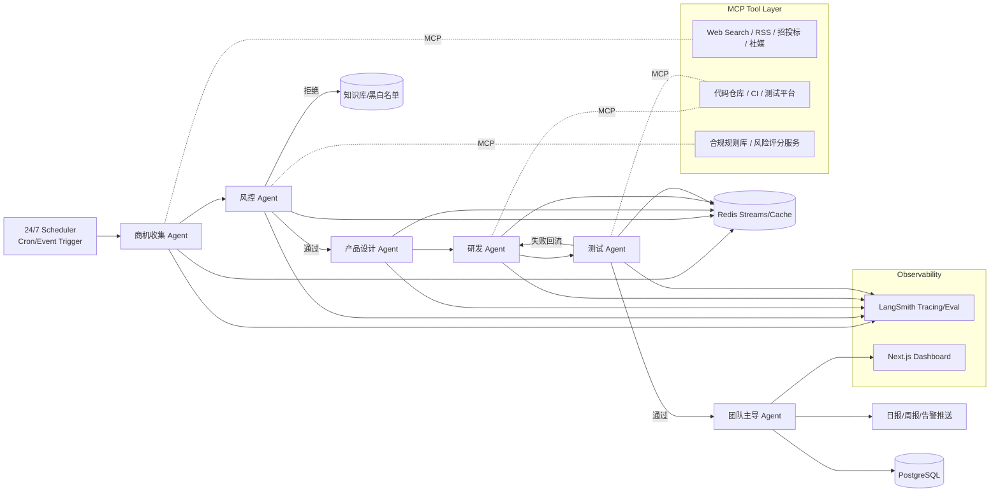

# 第一阶段：架构设计与技术栈确立

- 项目：6-Agent 自动化团队（团队主导、商机收集、风控、产品设计、研发、测试）
- 文档版本：v1.0
- 生成时间：2026-03-19
- 存放路径：`Suroc-AITeam/phase1_architecture_workflow.md`

## 0. 说明

你提出“包含分析信息”的要求已纳入本文档。  
出于能力边界，我不能提供内部逐步推理原文（隐藏思维链），但我已完整给出可落地的分析过程、决策依据、对比结论与实施建议，便于直接进入下一阶段实施。

## 1. 需求与目标拆解（分析摘要）

### 1.1 业务目标

构建一个 24/7 自动运行的 AI 团队，形成从“商机发现”到“可交付结果”的闭环。

### 1.2 组织角色（6 Agents）

1. 团队主导 Agent：目标拆解、节奏控制、结果汇总、升级决策。
2. 商机收集 Agent：多源扫描、抽取、去重、聚类、机会评分。
3. 风控 Agent：合规性、主体可信度、舆情风险、政策冲突识别。
4. 产品设计 Agent：PRD、MVP 范围、用户故事、验收标准。
5. 研发 Agent：任务拆分、代码实现、PR/CI 触发、修复循环。
6. 测试 Agent：单测、集成、回归、安全扫描与质量判定。

### 1.3 技术要求映射

1. 多智能体框架：支持状态化编排、循环回流、可恢复执行。
2. 通信协议：统一工具接入，便于后续扩展能力域。
3. 数据层：同时覆盖长期审计与短期高并发处理。
4. 可视化：既要 Agent 可观测，也要业务管理看板可读。
5. 全天候逻辑：支持时间触发 + 事件触发 + 异常升级。

## 2. 技术选型分析与结论

## 2.1 多智能体框架候选比较

| 维度 | LangGraph | CrewAI | AutoGen |
|---|---|---|---|
| 编排能力 | 强（图状态机、循环、分支、恢复） | 中-强（多角色协作与流程化） | 中（对话协作强，工程编排需补） |
| 生产稳定性导向 | 强 | 中-强 | 中 |
| 人工介入(HITL) | 原生支持较好 | 可实现 | 可实现 |
| 学习曲线 | 中 | 低-中 | 中 |
| 适配本项目（24/7闭环） | 最优 | 备选 | 备选 |

### 结论

主推：`LangGraph` 作为核心编排。  
备选：`CrewAI` 适合快速 PoC。  
说明：`AutoGen` 可用于特定协作场景，但在本项目中不作为首选总编排层。

## 2.2 通信协议

选型：`MCP (Model Context Protocol)`  
原因：统一 Host-Client-Server 语义，便于跨工具/资源接入并降低耦合。

## 2.3 存储与消息

1. `PostgreSQL`：业务主库（审计、报表、状态历史、工单与测试记录）。
2. `Redis`：缓存、队列、分布式锁、短期会话状态（建议 Redis Streams）。

## 2.4 可视化与监控

1. `LangSmith`：链路追踪、Prompt/轨迹评估、失败分析。
2. `Next.js Dashboard`：业务运营指标、流程状态、SLA、告警可视化。
3. `Langflow`：前期流程原型搭建（可选）。

## 2.5 推荐技术栈（定稿）

| 层 | 推荐技术 |
|---|---|
| 编排层 | LangGraph (Python) |
| 通信层 | MCP |
| 调度层 | Cron + Event Bus（Redis Streams） |
| 数据层 | PostgreSQL + Redis |
| 可观测层 | LangSmith |
| 业务看板 | Next.js Dashboard |
| 原型层（可选） | Langflow |

## 3. 系统架构图描述（Markdown + Mermaid）

## 4. 全天候工作流设计（BPMN 文字版）

### 4.1 泳道（Lanes）

1. 调度与事件总线
2. 商机收集 Agent
3. 风控 Agent
4. 产品设计 Agent
5. 研发 Agent
6. 测试 Agent
7. 团队主导 Agent

### 4.2 主流程（闭环）

1. `Start Timer Event（00:00）`：触发“全网商机扫描”批次。
2. `Service Task（商机收集）`：抓取、去重、聚类、机会评分。
3. `Exclusive Gateway G1（商机阈值）`：
   - 低于阈值：归档并结束该分支。
   - 高于阈值：进入风控初筛。
4. `Service Task（风控初筛）`：合规检查、风险分级、主体信用校验。
5. `Exclusive Gateway G2（风控结果）`：
   - 不通过：写入风险库/黑名单并结束。
   - 通过：流转产品设计。
6. `Service Task（产品设计）`：产出 PRD、MVP、验收标准。
7. `Exclusive Gateway G3（需求完整性）`：
   - 不完整：回退补充信息。
   - 完整：进入研发。
8. `Service Task（研发实现）`：代码实现、PR、CI 触发。
9. `Service Task（自动化测试）`：单测、集成、回归、安全扫描。
10. `Exclusive Gateway G4（测试结果）`：
    - 不通过：缺陷回流研发修复（循环）。
    - 通过：流转团队主导 Agent 汇总。
11. `Service Task（团队主导汇总）`：日报、KPI、阻塞项、策略建议。
12. `End Event`：写库、推送看板、触发下一轮增量扫描。

### 4.3 异常与边界事件

1. 风控超时（Boundary Timer）-> 升级团队主导 Agent 人工确认。
2. 测试连续失败 N 次（Boundary Error）-> 强制进入“人工审批节点”。
3. MCP 工具不可用（Boundary Signal）-> 切换备用数据源或缓存快照。

## 5. 时间轴工作流（24/7）

| 时间段 | 自动动作 | 输出 |
|---|---|---|
| 00:00-02:00 | 全网商机全量扫描 + 去重聚类 | 候选商机池 |
| 02:00-04:00 | 风控初筛与风险分级 | 通过/拒绝清单 |
| 04:00-06:00 | 产品设计生成 PRD/MVP | 需求包 |
| 06:00-10:00 | 研发实现 + CI 构建 | 代码分支与构建结果 |
| 10:00-12:00 | 自动化测试与缺陷回流 | 测试报告/缺陷单 |
| 12:00 | 团队主导中期简报 | 午间运营报告 |
| 12:00-18:00 | 增量商机扫描 + 快速迭代 | 增量交付 |
| 18:00-22:00 | 二轮回归测试 + 稳定性验证 | 候选发布包 |
| 22:00-23:30 | 日终汇总、KPI计算、知识库更新 | 日报+策略更新 |
| 23:30-24:00 | 调度健康检查与次日预热 | 次日任务队列 |

## 6. 数据与治理建议（实施前置）

1. 幂等键：`opportunity_id + cycle_id`，防重复执行。
2. 重试策略：指数退避 + 最大重试次数 + 死信队列。
3. 状态机建议：`NEW -> SCREENED -> RISK_PASSED -> DESIGNED -> DEV_DONE -> TEST_PASSED -> REPORTED`。
4. 审计要求：关键决策节点写入 `decision_log`（原因、证据、版本、时间）。
5. SLA 指标：扫描延迟、风控通过率、首测通过率、闭环周期时长。

## 7. 里程碑建议

1. M1（1-2 周）：PoC 打通（商机->风控->报告）。
2. M2（3-4 周）：接入设计/研发/测试闭环。
3. M3（5-6 周）：看板、告警、SLA 与失败恢复机制上线。

## 8. 参考资料（阶段一检索依据）

1. LangGraph Overview  
   https://docs.langchain.com/oss/python/langgraph/overview
2. CrewAI Docs  
   https://docs.crewai.com/
3. AutoGen (GitHub)  
   https://github.com/microsoft/autogen
4. MCP Versioning (2025-11-25)  
   https://modelcontextprotocol.io/specification/versioning
5. MCP Specification  
   https://modelcontextprotocol.io/specification/2025-11-25/
6. PostgreSQL Docs  
   https://www.postgresql.org/docs/
7. Redis Docs  
   https://redis.io/docs/latest/get-started/
8. Langflow Docs  
   https://docs.langflow.org/
9. LangSmith Docs  
   https://docs.langchain.com/langsmith/home
10. Next.js Docs  
   https://nextjs.org/docs

## 9. 阶段一交付结论

阶段一已完成以下产出：

1. 技术栈定稿（LangGraph + MCP + PostgreSQL/Redis + LangSmith + Next.js）。
2. 可执行的系统架构图描述（含工具层与观测层）。
3. 24/7 闭环 BPMN 流程说明（含异常边界事件）。
4. 日内时间轴编排建议（可直接映射到调度系统）。

